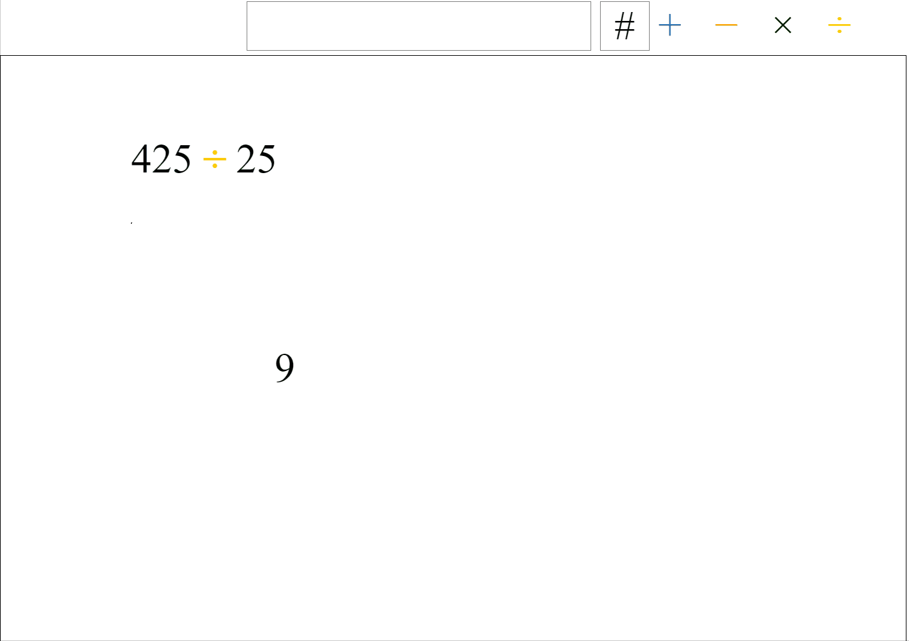

# Math Playground
A prototype that demonstrates the idea of dynamic animations: animating the user's specific problem.

(I wrote this when I was in 11th/12th grade, and it was my first big web project. It doesn't use good conventions, by ES6 and any other, and is not very extendable. But the prototype says what I want it to: there's an interesting way to approach teaching math through dynamic animation.)
